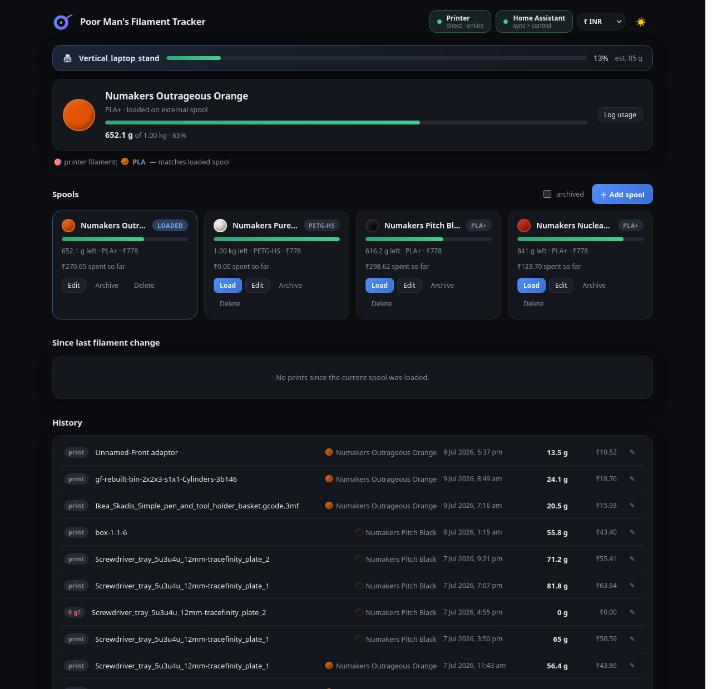
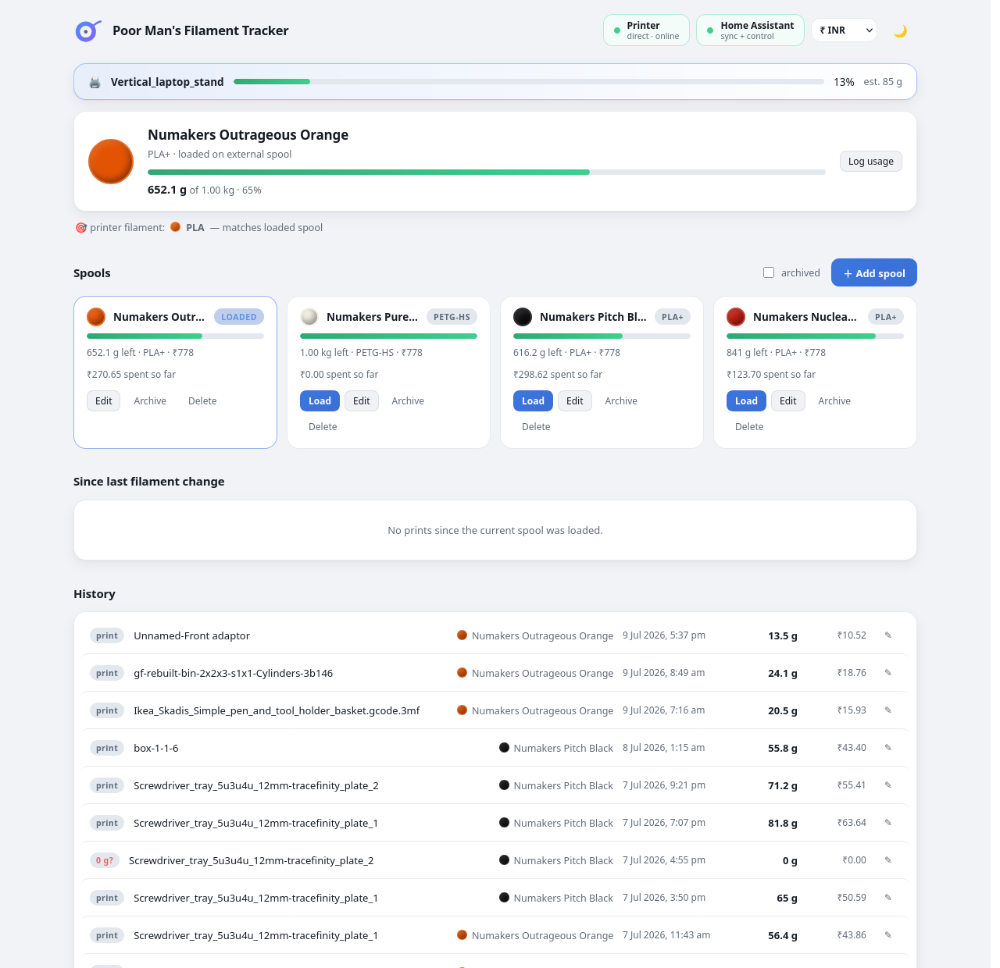

<div align="center">
  

  # Poor Man's Filament Tracker

  **Self-hosted spool inventory and cost tracking for Bambu Lab printers — no cloud, no subscription, no RFID tax.**

  
  
  
  

</div>

There are smart spool systems out there with RFID tags, companion apps,
and subscriptions. This is not one of them. This is a 100 MB Docker
container that talks to a Bambu Lab printer directly and figures out
which spool is loaded by staring really hard at the material and color.

No cloud. No proprietary tags sold in packs of four for the price of an
actual filament roll. Just a container, the printer's LAN credentials,
and a SQLite file quietly doing the bookkeeping — so nobody has to guess
whether that half-empty spool of "definitely PLA, probably black" is 40%
or 60% gone.

---

## ✨ Features

- 🖨️ **Automatic usage deduction** — connects straight to the printer
  over its local MQTT + FTPS interfaces and reads each job's sliced
  filament weight from the 3MF file, deducting it from the loaded spool
  the moment a print finishes or fails (prorated by progress, because a
  print that died at 80% did not use 0 g, whatever the printer would
  like everyone to believe).
- 🎯 **Auto-detects the loaded spool** — matches the printer's
  external-spool filament setting (material + color) against the spool
  library and loads the right one automatically. When two spools are
  identical twins with no electronic way to tell them apart (see: the
  entire premise of this project), it asks for confirmation instead of
  guessing.
- 🧵 **Spool library** — brand, material, color, weight, cost — picked
  from a built-in catalog (Numakers, Bambu Lab, eSUN, Polymaker, SUNLU,
  Overture, Hatchbox) or entered by hand for filament obscure enough
  that nobody has cataloged it.
- 💸 **Cost tracking** — give a spool a price and the app reports, with
  slightly uncomfortable precision, exactly how much money each print
  cost — including the failed one that is now a decorative paperweight.
  A dozen currencies are available in the header, because heartbreak is
  universal but the symbol should at least be right.
- 📜 **Print history** — every print logged with weight and cost. Grams
  can be corrected if the weight fetch face-planted, and prints can be
  reassigned to a different spool after one of those filament swaps the
  app was never told about. It happens. It's fine.
- 🏠 **Optional Home Assistant integration** — publishes a
  `sensor.filament_tracker_remaining` sensor and an
  `input_select.loaded_filament_spool` helper, so the loaded spool can
  be checked from a dashboard instead of by walking to the printer like
  some kind of caveman. Tracking keeps running over the direct
  connection even when HA is down.
- 🌗 **Light/dark theme**, because even a poor man's tool shouldn't burn
  retinas at 2 AM while babysitting a print.

## 📸 Screenshots



<details>
<summary>Prefer it in light mode?</summary>



</details>

## 🧠 How it works

One Docker container, one embedded web UI, one REST API, one SQLite
file. No database server, no message queue, no microservices — this is a
filament tracker, not a distributed systems thesis. It connects to the
printer's MQTT (status, progress, loaded filament) and FTPS (the sliced
3MF, which is the only place the actual gram count lives — the printer
won't just say it) directly over the LAN. Home Assistant is entirely
optional; with the [ha-bambulab](https://github.com/greghesp/ha-bambulab)
integration installed, the app can alternatively read the same printer
data secondhand through HA's websocket.

## 🚀 Getting started

### Requirements

- Docker (with Compose)
- A Bambu Lab printer (P1/X1/A1 series) with LAN access enabled
- Three values from the printer's own screen (Settings → Network /
  Device / WLAN): its IP, serial number, and LAN access code

Nothing to sign up for, nothing to buy.

### Installation

```bash
git clone https://github.com/YaddyVirus/Poor-Man-s-Filament-Tracker.git
cd Poor-Man-s-Filament-Tracker
cp .env.example .env
# edit .env: printer IP/serial/access code (and HA URL/token, if used)
docker compose up -d --build
```

Open `http://<host>:8099` and start feeding it spools.

### Configuration

Everything is an environment variable, set in `.env` (copy
`.env.example` and fill in the blanks). The `.env` file is gitignored
for a reason — printer credentials and HA tokens belong on the machine,
not in a commit history.

| Variable | Purpose |
| -------- | ------- |
| `PRINTER_HOST` / `PRINTER_SERIAL` / `PRINTER_ACCESS_CODE` | Direct printer connection — all three are on the printer's screen |
| `HA_URL` | Home Assistant base URL, e.g. `http://192.168.1.50:8123` (optional) |
| `HA_TOKEN` | HA long-lived access token (profile → Security → Long-lived access tokens) |
| `DEDUCT_ON_FAILED` | Prorate failed prints by progress (default `true`) |
| `AUTO_SELECT_SPOOL` | Auto-load the spool matching the printer's filament setting (default `true`) |

With the `PRINTER_*` variables left empty, the app falls back to reading
printer state through Home Assistant instead (requires `HA_URL` /
`HA_TOKEN` and the ha-bambulab integration already installed there).

**Adding it to the HA sidebar** (optional, but satisfying) — in
`configuration.yaml`:

```yaml
panel_iframe:
  filament:
    title: Filament
    icon: mdi:printer-3d-nozzle
    url: "http://<docker-host>:8099"
```

## 🕹️ Using it

- **Add spools** via "＋ Add spool" — pick a brand and color from the
  catalog or go rogue with custom values, set the weight and, for the
  brave, the price paid.
- **Load a spool** manually with the "Load" button, or let auto-detect
  notice what's set on the printer. It's usually right; when it isn't
  sure, it asks instead of quietly corrupting the cost history.
- **Pick a currency** from the header dropdown. It's cosmetic — see
  Limitations before expecting exchange-rate math.
- **Fix mistakes** in the History panel: correct a print's grams,
  reassign it to another spool, or bulk-move everything recorded since
  the last spool change after a filament swap the app wasn't told about.
  The app forgives. The wallet remembers.
- The deeper cuts — Home Assistant setup, cost math, twin-spool
  detection — live in [DOCS.md](DOCS.md).

## ⚠️ Current limitations

Reasons this is called the *poor man's* tracker and not "Enterprise
Filament Resource Planning Suite":

- **Bambu Lab only, one printer per instance.** The direct connection
  speaks Bambu's own MQTT/FTPS dialect. Other printers and this project
  have nothing to say to each other.
- **Weight is the slicer's estimate, not a scale reading.** It comes
  from the 3MF's `slice_info.config`, because a printer is not a postal
  scale and has no idea what a spool weighs. If the fetch fails, the
  print is recorded at 0 g and flagged for manual correction.
- **No RFID, no NFC, no electronic spool ID of any kind.** Not paying
  for that is the whole point. Identification works by matching material
  and color against the library, which means two identical spools
  genuinely cannot be told apart by software — a one-time confirmation
  settles it, and the answer is remembered.
- **Cost is derived, not frozen at print time.** Per-print cost is
  computed live from the spool's *current* cost ÷ weight ratio. Editing
  a spool's cost later quietly recosts its past prints. Great for fixing
  typos; a footgun for anyone doing real accounting.
- **The currency picker changes a symbol, not a value.** No exchange
  rates, no conversion. It will not make the filament cheaper. Nothing
  will.
- **No login, no auth, nothing.** Anyone who can reach the container's
  port can see and edit every spool. This is a garage tool for a trusted
  home network — port-forwarding it to the open internet is a choice,
  and a bad one.
- **One SQLite file, one instance.** Perfectly happy tracking one
  person's filament habit. Not the backend for a print farm with a shift
  schedule.

## 🔧 Troubleshooting

**A print shows "0 g?" in History.**
The 3MF fetch from the printer failed (it happens — FTPS on these
printers is moody). Click the ✎ on the entry and type in the grams from
the slicer. The spool's remaining weight recalculates.

**Usage went to the wrong spool.**
Swapped filament without telling the app? "Move all" in the *Since last
filament change* panel shifts every print since the swap to the right
spool in one go.

**The verify card keeps asking which spool is loaded.**
Two spools in the library are the same brand, material, and color. The
app physically cannot tell them apart (nothing can — that's the RFID
money talking). Confirm once and it remembers until the situation
changes.

**Home Assistant shows the sensor as unavailable.**
The app re-pushes the sensor every few minutes and reconnects
automatically when HA comes back. If it stays unavailable, check
`HA_URL`/`HA_TOKEN` in `.env` and the container logs:
`docker logs filament-tracker`.

## 👤 Author

Developed by **Yadullah Abidi** — [@YaddyVirus](https://github.com/YaddyVirus)

## 📄 License

MIT — see [LICENSE](LICENSE). Free as in "cheaper than an RFID tag."
